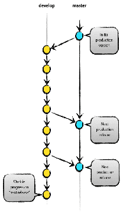
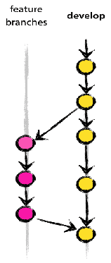

# Create Amazon Machine Image (AMI) with the following steps

Goal: Create an Amazon Machine Image (AMI) with the following steps:

Tools: AWS, Ansible, Jenkins, AWS KMS,Packer,Terraform

1. Create an EC2 instance with the desired configuration.
    Example:
    - AMI: Amazon Linux 2
    - Instance Type: t2.micro
    - Block device mapping: EBS volume mapping (<https://docs.aws.amazon.com/AWSEC2/latest/UserGuide/block-device-mapping-concepts.html>)

2. Install the prerequestes software and configure.
3. Install base packages for wordpress software including apache, php, mysql.
4. Each task configured under ansible roles.
Like below directory structure:

        ```
        ├── ansible
        │   ├── roles
        │   │   ├── common
        │   │   │   ├── tasks
        │   │   │   │   ├── main.yml
        │   │   │   ├── vars
        │   │   │   │   ├── main.yml
        │   │   │   ├── files
        │   │   │   │   ├── main.yml
        │   │   │   ├── templates
        │   │   │   │   ├── main.yml
        │   │   ├── install-nginx
        │   │   │   │   ├── tasks
        │   │   │   │   │   ├── main.yml
        │   │   │   │   ├── vars
        │   │   │   │   │   ├── main.yml
        │   │   │   │   ├── files
        │   │   │   │   │   ├── main.yml
        ```
5. Apache/Nginx server hardiging configurations.
6. Create bootstrapping script to run during the instance launch. Script can be shell or python script which will do initial setup of the instance. Include password specific to production and nonprod environments.
7. Encript AMI using AWS KMS key.
8. Run CIS-CAT scan on after inital AMI creation.
9. Create testing pipeline to test the AMI.
10. All above steps should be automated using Jenkins pipeline.
11. Ideally single AMI should be created for each environment (dev, test, prod). Environemnt specific configurations should be automated duing bootstrapping script.

# Infrastructure as Code (IaC) using Terraform

Goal: Create Infrastructure as Code (IaC) using Terraform for the following infrastructure:

Tools: Terraform, AWS

## Current Infrastructure

](terraform/image/iac-current.png)

## Future Infrastructure

](terraform/image/iac-future.png)

1. Create a Terraform script for Autoscaling,lunch configuration, security group, Route53, s3 bucket, RDS and IAM roles.
2. Each resource should be created in separate terraform file.
3. Each environment should have separate terraform variable file under envrionment directory.
Example:

```
    bash
    ├── terraform
    │   ├── env
    │   │   ├── nonprod.tfvars
    │   │   ├── prod.tfvars
    │   │   ├── dev.tfvars
    │   autoscaling.tf
    │   launch_configuration.tf
    │   security_group.tf
    │   route53.tf
    │   s3_bucket.tf
    │   rds.tf
    │   alb.tf

```

4. Use terraform shared modules, keep forked module in separate repository and include in main terraform script. Enalbe sync with upstream repository as best practice. Ensure tags are added to each resource module.
    Example:

        module "autoscaling" {
        source = "git::<https://example.com/alb.git?ref=v1.2.0>"
            tags = {
                Name = "autoscaling"
                Environment = "nonprod"
            }
        }

5. Use terraform state file in S3 bucket.
6. Create ACM certificate(Wild card if planning to use same hosted zone for other applications) for the domain and attach to the load balancer.
7. Secrets can be stored in Vault retrive during the instance launch through bootstrapping script.
8. Enable required inbound and outbound rules in security group for alb and ec2 instances.
9. Create RDS for backend database with multi AZ to store application data.
10. Create stateless infrastructure to scale up and down based on the traffic.
11. If any application specific configurations can be stored in S3 bucket and retrive during the instance launch.
12. Enable role based access to the EC2 instances.
13. Create EC2 instance profile for specific role and attach to the instance for specific access.(Example: S3 access,etc)
14. Blue green deployments can be achieved using Route53 and ALB.
15. Enable monitoring and alerting for the infrastructure using cloudwatch/splunk/appdynamics.


## Branching model:

1. Create develop and master branch.
2. Create feature branch from develop branch. Once feature is completed.
4. Create pull request to develop branch. Once approved, merge to develop branch.
5. Create release branch from develop branch. Once testing is completed. 
6. Create pull request to master branch. Once approved, merge to master branch.
7. Use nonprod from develop and prod from master branch for testing and production environment.

 