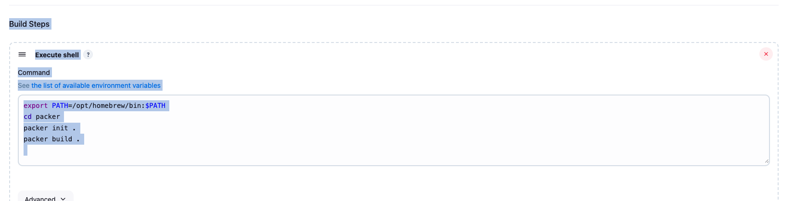
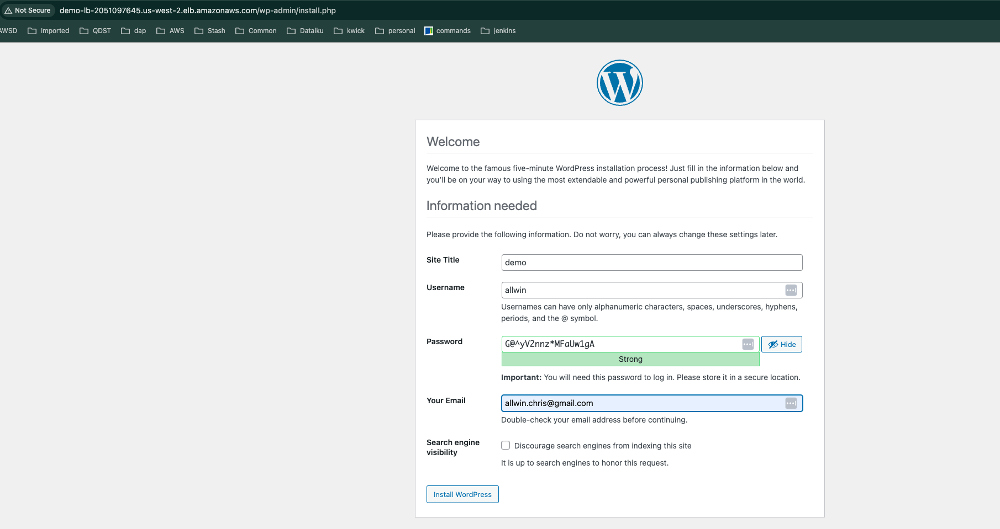
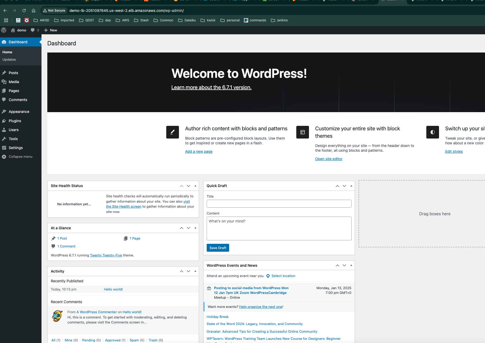

# Create AMI using Packer jenkins pipeline

This project demonstrates how to create an Amazon Machine Image (AMI) using Packer and Jenkins pipeline. The Packer template provisions an EC2 instance, installs the required software, and creates an AMI. The Jenkins pipeline automates the build process and triggers the Packer build job.

## Sample jenkins job to create AMI using Packer



### Jenkins pipeline stages:

```
 PATH=/opt/homebrew/bin:/usr/bin:/bin:/usr/sbin:/sbin
+ cd packer
+ packer init .
+ packer build .
[1;32mamazon-ebs.demo: output will be in this color.[0m

[1;32m==> amazon-ebs.demo: Prevalidating any provided VPC information[0m
[1;32m==> amazon-ebs.demo: Prevalidating AMI Name: packer-demo-ami[0m
[0;32m    amazon-ebs.demo: Found Image ID: ami-07d9cf938edb0739b[0m
[1;32m==> amazon-ebs.demo: Creating temporary keypair: packer_67707339-6fc7-8d41-a244-1f233ef7a6d4[0m
[1;32m==> amazon-ebs.demo: Creating temporary security group for this instance: packer_6770733c-07a7-9ee1-07d3-7d7b7414c68e[0m
[1;32m==> amazon-ebs.demo: Authorizing access to port 22 from [0.0.0.0/0] in the temporary security groups...[0m
[1;32m==> amazon-ebs.demo: Launching a source AWS instance...[0m
[0;32m    amazon-ebs.demo: Instance ID: i-00c15c038e0a72b37[0m
[1;32m==> amazon-ebs.demo: Waiting for instance (i-00c15c038e0a72b37) to become ready...[0m
[1;32m==> amazon-ebs.demo: Using SSH communicator to connect: 35.167.198.142[0m
[1;32m==> amazon-ebs.demo: Waiting for SSH to become available...[0m
[1;32m==> amazon-ebs.demo: Connected to SSH![0m
[1;32m==> amazon-ebs.demo: Provisioning with shell script: /var/folders/lq/8v_mkhsj57j531xtmy246glr0000gn/T/packer-shell1273668320[0m
[0;32m    amazon-ebs.demo: Amazon Linux 2023 Kernel Livepatch repository    66 kB/s |  11 kB     00:00[0m
[0;32m    amazon-ebs.demo: Dependencies resolved.[0m
[0;32m    amazon-ebs.demo: ================================================================================[0m
[0;32m    amazon-ebs.demo:  Package          Arch       Version                      Repository       Size[0m
[0;32m    amazon-ebs.demo: ================================================================================[0m
[0;32m    amazon-ebs.demo: Installing:[0m
[0;32m    amazon-ebs.demo:  ansible          noarch     8.3.0-1.amzn2023.0.1         amazonlinux      32 M[0m
[0;32m    amazon-ebs.demo: Installing dependencies:[0m
[0;32m    amazon-ebs.demo:  ansible-core     x86_64     2.15.3-1.amzn2023.0.4        amazonlinux     2.5 M[0m
[0;32m    amazon-ebs.demo:  git-core         x86_64     2.40.1-1.amzn2023.0.3        amazonlinux     4.3 M[0m
[0;32m    amazon-ebs.demo:  sshpass          x86_64     1.09-6.amzn2023.0.1          amazonlinux      28 k[0m
[0;32m    amazon-ebs.demo:[0m
[0;32m    amazon-ebs.demo: Transaction Summary[0m
[0;32m    amazon-ebs.demo: ================================================================================[0m
[0;32m    amazon-ebs.demo: Install  4 Packages[0m
[0;32m    amazon-ebs.demo:[0m
[0;32m    amazon-ebs.demo: Total download size: 39 M[0m
[0;32m    amazon-ebs.demo: Installed size: 549 M[0m
[0;32m    amazon-ebs.demo: Downloading Packages:[0m
[0;32m    amazon-ebs.demo: (1/4): git-core-2.40.1-1.amzn2023.0.3.x86_64.rp  24 MB/s | 4.3 MB     00:00[0m
[0;32m    amazon-ebs.demo: (2/4): ansible-core-2.15.3-1.amzn2023.0.4.x86_6  13 MB/s | 2.5 MB     00:00[0m
[0;32m    amazon-ebs.demo: (3/4): sshpass-1.09-6.amzn2023.0.1.x86_64.rpm   1.5 MB/s |  28 kB     00:00[0m
[0;32m    amazon-ebs.demo: (4/4): ansible-8.3.0-1.amzn2023.0.1.noarch.rpm   53 MB/s |  32 MB     00:00[0m
[0;32m    amazon-ebs.demo: --------------------------------------------------------------------------------[0m
[0;32m    amazon-ebs.demo: Total                                            60 MB/s |  39 MB     00:00[0m
[0;32m    amazon-ebs.demo: Running transaction check[0m
[0;32m    amazon-ebs.demo: Transaction check succeeded.[0m
[0;32m    amazon-ebs.demo: Running transaction test[0m
[0;32m    amazon-ebs.demo: Transaction test succeeded.[0m
[0;32m    amazon-ebs.demo: Running transaction[0m
[0;32m    amazon-ebs.demo:   Preparing        :                                                        1/1[0m
[0;32m    amazon-ebs.demo:   Installing       : sshpass-1.09-6.amzn2023.0.1.x86_64                     1/4[0m
[0;32m    amazon-ebs.demo:   Installing       : git-core-2.40.1-1.amzn2023.0.3.x86_64                  2/4[0m
[0;32m    amazon-ebs.demo:   Installing       : ansible-core-2.15.3-1.amzn2023.0.4.x86_64              3/4[0m
[0;32m    amazon-ebs.demo:   Installing       : ansible-8.3.0-1.amzn2023.0.1.noarch                    4/4[0m
[0;32m    amazon-ebs.demo:   Running scriptlet: ansible-8.3.0-1.amzn2023.0.1.noarch                    4/4[0m
[0;32m    amazon-ebs.demo:   Verifying        : ansible-8.3.0-1.amzn2023.0.1.noarch                    1/4[0m
[0;32m    amazon-ebs.demo:   Verifying        : ansible-core-2.15.3-1.amzn2023.0.4.x86_64              2/4[0m
[0;32m    amazon-ebs.demo:   Verifying        : git-core-2.40.1-1.amzn2023.0.3.x86_64                  3/4[0m
[0;32m    amazon-ebs.demo:   Verifying        : sshpass-1.09-6.amzn2023.0.1.x86_64                     4/4[0m
[0;32m    amazon-ebs.demo:[0m
[0;32m    amazon-ebs.demo: Installed:[0m
[0;32m    amazon-ebs.demo:   ansible-8.3.0-1.amzn2023.0.1.noarch[0m
[0;32m    amazon-ebs.demo:   ansible-core-2.15.3-1.amzn2023.0.4.x86_64[0m
[0;32m    amazon-ebs.demo:   git-core-2.40.1-1.amzn2023.0.3.x86_64[0m
[0;32m    amazon-ebs.demo:   sshpass-1.09-6.amzn2023.0.1.x86_64[0m
[0;32m    amazon-ebs.demo:[0m
[0;32m    amazon-ebs.demo: Complete![0m
[1;32m==> amazon-ebs.demo: Provisioning with Ansible...[0m
[0;32m    amazon-ebs.demo: Uploading Playbook directory to Ansible staging directory...[0m
[0;32m    amazon-ebs.demo: Creating directory: /tmp/packer-provisioner-ansible-local/677073a0-899c-b7d7-9015-45e777ef7d4e[0m
[0;32m    amazon-ebs.demo: Uploading inventory file...[0m
[0;32m    amazon-ebs.demo: Executing Ansible: cd /tmp/packer-provisioner-ansible-local/677073a0-899c-b7d7-9015-45e777ef7d4e &&  ansible-playbook /tmp/packer-provisioner-ansible-local/677073a0-899c-b7d7-9015-45e777ef7d4e/main.yml --extra-vars "packer_build_name=demo packer_builder_type=amazon-ebs packer_http_addr=ERR_HTTP_ADDR_NOT_IMPLEMENTED_BY_BUILDER -o IdentitiesOnly=yes"  -c local -i /tmp/packer-provisioner-ansible-local/677073a0-899c-b7d7-9015-45e777ef7d4e/packer-provisioner-ansible-local3086178825[0m
[0;32m    amazon-ebs.demo:[0m
[0;32m    amazon-ebs.demo: PLAY [localhost] ***************************************************************[0m
[0;32m    amazon-ebs.demo:[0m
[0;32m    amazon-ebs.demo: TASK [Update packages] *********************************************************[0m
[1;31m==> amazon-ebs.demo: [WARNING]: Platform linux on host 127.0.0.1 is using the discovered Python[0m
[1;31m==> amazon-ebs.demo: interpreter at /usr/bin/python3.9, but future installation of another Python[0m
[1;31m==> amazon-ebs.demo: interpreter could change the meaning of that path. See[0m
[1;31m==> amazon-ebs.demo: https://docs.ansible.com/ansible-[0m
[1;31m==> amazon-ebs.demo: core/2.15/reference_appendices/interpreter_discovery.html for more information.[0m
[0;32m    amazon-ebs.demo: ok: [127.0.0.1][0m
[0;32m    amazon-ebs.demo:[0m
[0;32m    amazon-ebs.demo: TASK [Install Apache] **********************************************************[0m
[0;32m    amazon-ebs.demo: changed: [127.0.0.1][0m
```

```
[0;32m    amazon-ebs.demo: TASK [Restart HTTPD service] ***************************************************[0m
[0;32m    amazon-ebs.demo: changed: [127.0.0.1][0m
[0;32m    amazon-ebs.demo:[0m
[0;32m    amazon-ebs.demo: PLAY RECAP *********************************************************************[0m
[0;32m    amazon-ebs.demo: 127.0.0.1                  : ok=30   changed=23   unreachable=0    failed=0    skipped=2    rescued=0    ignored=0[0m
[0;32m    amazon-ebs.demo:[0m
[1;32m==> amazon-ebs.demo: Stopping the source instance...[0m
[0;32m    amazon-ebs.demo: Stopping instance[0m
[1;32m==> amazon-ebs.demo: Waiting for the instance to stop...[0m
[1;32m==> amazon-ebs.demo: Creating AMI packer-demo-ami from instance i-0599b0d9027f28880[0m
[0;32m    amazon-ebs.demo: AMI: ami-06f52f3c884c4813c[0m
[1;32m==> amazon-ebs.demo: Waiting for AMI to become ready...[0m
[1;32m==> amazon-ebs.demo: Skipping Enable AMI deprecation...[0m
[1;32m==> amazon-ebs.demo: Skipping Enable AMI deregistration protection...[0m
[1;32m==> amazon-ebs.demo: Terminating the source AWS instance...[0m
[1;32m==> amazon-ebs.demo: Cleaning up any extra volumes...[0m
[1;32m==> amazon-ebs.demo: No volumes to clean up, skipping[0m
[1;32m==> amazon-ebs.demo: Deleting temporary security group...[0m
[1;32m==> amazon-ebs.demo: Deleting temporary keypair...[0m
[1;32mBuild 'amazon-ebs.demo' finished after 7 minutes 29 seconds.[0m

==> Wait completed after 7 minutes 29 seconds

==> Builds finished. The artifacts of successful builds are:
--> amazon-ebs.demo: AMIs were created:
us-west-2: ami-06f52f3c884c4813c

Finished: SUCCESS
```


### Create infrastructure using Terraform from jenkins pipeline:

!terraform/image/terraform-apply.png

### terraform plan output:(success)
```
[1mPlan:[0m 7 to add, 0 to change, 0 to destroy.
[0m
Changes to Outputs:
   subnets    = [
       "subnet-02406d23e9ba0ee32",
       "subnet-0d0337546a0b395ff",
       "subnet-01488ae41a830d58a",
       "subnet-026c16d442cbfe071",
    ]
   vpc_id     = "vpc-0f39b462277427bab"
   websiteurl = (known after apply)
[90m
```

### terraform apply output:(success)
```
Apply complete! Resources: 7 added, 0 changed, 0 destroyed.
[0m[0m[1m[32m
Outputs:

[0msubnets = tolist([
  "subnet-02406d23e9ba0ee32",
  "subnet-0d0337546a0b395ff",
  "subnet-01488ae41a830d58a",
  "subnet-026c16d442cbfe071",
])
vpc_id = "vpc-0f39b462277427bab"
websiteurl = "http://demo-lb-2051097645.us-west-2.elb.amazonaws.com"
Finished: SUCCESS
```

## Access wordpress site using the website URL(AWS ELB URL):



